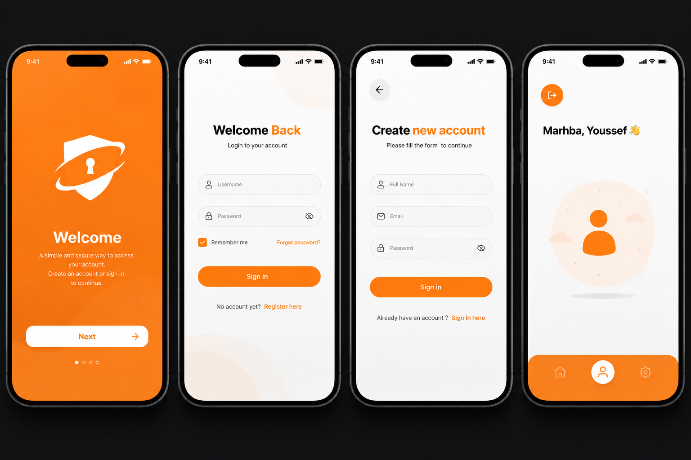

# Marhba 👋

Application mobile minimaliste d'authentification permettant à un utilisateur de créer un compte, se connecter et accéder à un espace personnel sécurisé.

Le projet met en pratique un circuit complet d'authentification :

* API Backend sécurisée avec Express + PostgreSQL
* Authentification JWT
* Hash des mots de passe avec bcrypt
* Protection des routes côté backend avec middleware
* Protection des écrans côté mobile avec Expo Router
* Gestion globale de l'authentification avec Zustand
* Persistance de session avec Expo SecureStore

---
<p align="center">
  
</p>

#  Architecture du projet

```
Marhba/
│
├── backend/
│   ├── config/
│   ├── controllers/
│   ├── middlewares/
│   ├── models/
│   ├── routes/
│   ├── .env
│   └── server.js
│
└── mobile/
    ├── app/
    │   ├── (auth)/
    │   │   ├── login.tsx
    │   │   └── register.tsx
    │   │
    │   └── (app)/
    │       └── home.tsx
    │
    ├── components/
    ├── services/
    ├── store/
    └── constants/
```

---

#  Stack technique

## Backend

* Node.js
* Express.js
* PostgreSQL
* Sequelize ORM
* bcrypt
* jsonwebtoken
* dotenv

## Mobile

* React Native
* Expo
* Expo Router
* Zustand
* Axios
* Expo SecureStore

---

# ⚙️ Installation

## 1. Cloner le projet

```bash
git clone <repository-url>

cd Marhba
```

---

# 🔹 Backend

Entrer dans le dossier :

```bash
cd backend
```

Installer les dépendances :

```bash
npm install
```

Créer un fichier `.env` :

```env
PORT=3009

DATABASE_URL=your_database_url

JWT_SECRET=your_secret
JWT_EXPIRES_IN=7d
```

Lancer le serveur :

```bash
npm run dev
```

Le serveur sera disponible sur :

```
http://localhost:3009
```

---

# 🔹 Mobile

Entrer dans le dossier :

```bash
cd mobile
```

Installer les dépendances :

```bash
npm install
```

Lancer Expo :

```bash
npx expo start
```

---

#  Authentification

## Register

Endpoint :

```
POST /api/auth/register
```

Création d'un compte utilisateur avec :

* Validation des données
* Hash du mot de passe avec bcrypt

---

## Login

Endpoint :

```
POST /api/auth/login
```

Retourne :

* JWT Access Token
* Informations utilisateur

---

## Profil utilisateur

Endpoint protégé :

```
GET /api/auth/me
```

Nécessite :

```
Authorization: Bearer <token>
```

Retourne les informations de l'utilisateur connecté.

---

#  Sécurité

Le projet applique une double protection :

## Backend

Middleware `authenticate` :

* Vérification du JWT
* Protection des routes API
* Ajout de l'utilisateur dans `req.user`

## Frontend

Expo Router :

* `<Stack.Protected>`
* Redirection automatique selon l'état d'authentification

---

#  Gestion de session

Le token est sauvegardé avec :

```
expo-secure-store
```

Au démarrage :

```
restoreSession()
        |
        ↓
Récupération du token
        |
        ↓
GET /auth/me
        |
        ↓
Validation du token
        |
        ↓
Connexion automatique
```

---

#  Axios

Une instance Axios est configurée avec :

* Base URL
* Request interceptor pour ajouter automatiquement :

```
Authorization: Bearer token
```

* Response interceptor :

Si l'API retourne :

```
401 Unauthorized
```

L'utilisateur est automatiquement déconnecté.

---

#  Zustand Store

Le store d'authentification contient :

```ts
{
 user,
 token,
 isAuthenticated,
 isLoading
}
```

Actions :

* login()
* register()
* logout()
* restoreSession()

---

#  Fonctionnalités

✅ Création de compte
✅ Connexion utilisateur
✅ Validation des formulaires
✅ Gestion des erreurs serveur
✅ Affichage du profil utilisateur
✅ Protection des routes API
✅ Protection des écrans mobiles
✅ Restauration automatique de session
✅ Déconnexion automatique si token expiré

---

#  Tests

Scénario principal :

1. Créer un compte
2. Se connecter
3. Accéder à l'accueil
4. Fermer l'application
5. Réouvrir l'application
6. Session restaurée automatiquement
7. Déconnexion
8. Retour à l'écran Login

---

#  Auteur

Projet réalisé dans un objectif pédagogique autour de l'authentification mobile complète.
